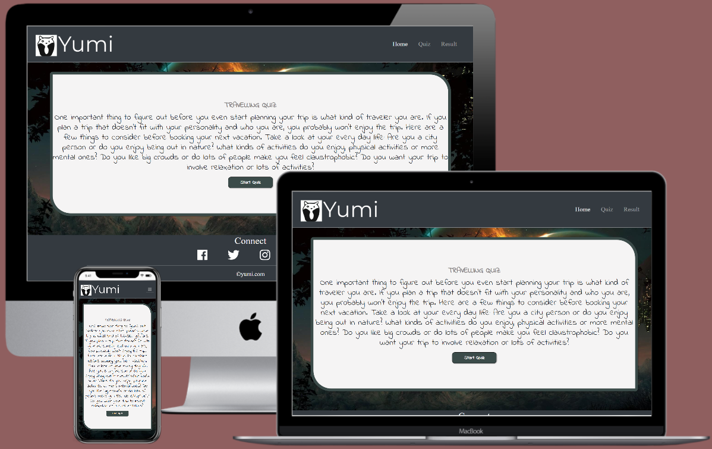
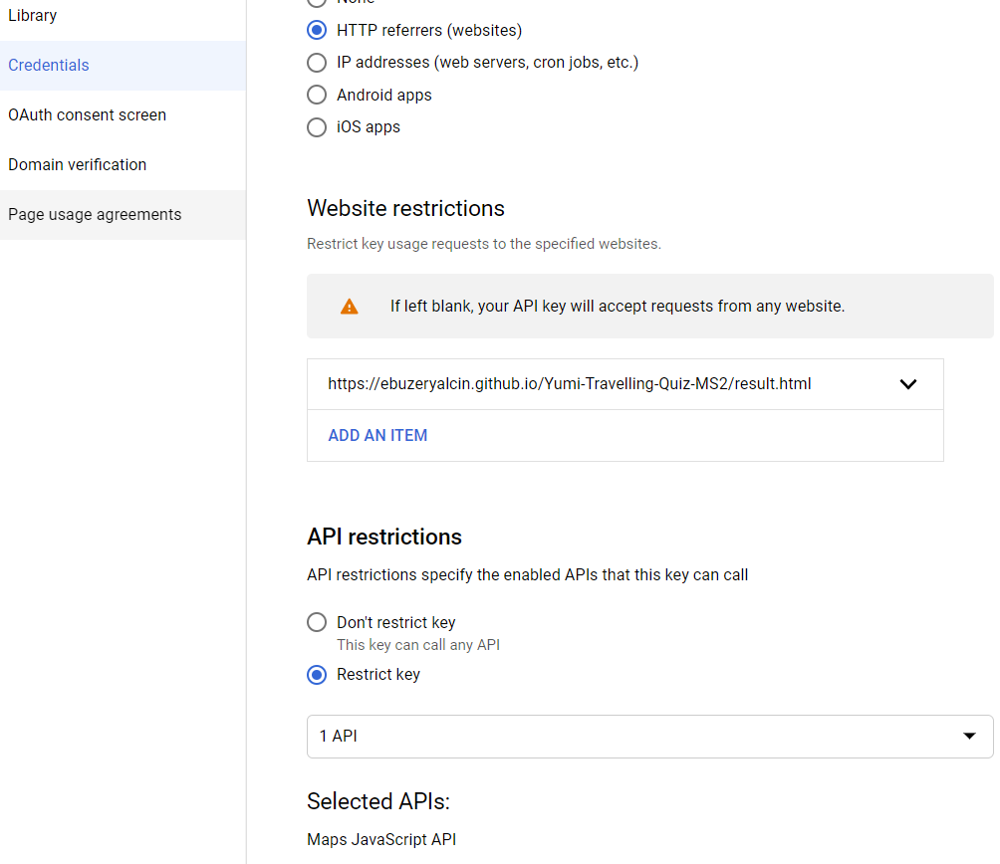

***

# Yumi Travelling Quiz

My project is a quiz for people who love to travel. Travelling to different destinations can be at point but sometimes you can also be disappointed maybe because you did not
think about if the travel destination have things that matches your personality. 

Therefore, at the beginning of the Quiz the page is asking you "WHAT TYPE OF TRAVELLER ARE YOU?" which really asks logical questions to decide whether you are a nature lover
or a city lover. I think that the most important thing to figure out before you even start planning a trip is what kind of traveler person you are, what do you enjoy. 
If you plan a trip that doesn’t fit your personality the trip can mostly be bad. You need to know who you are. 

By asking some questions that maybe do not come in mind in this quiz maybe you can consider few things before booking your next vacation. By starting the quiz I aim to get 
peoples attention to start thinking how their every day life is. Maybe to make users think about their daily environment, what they like and unlike about it. So they can start 
to reflect what travel destination would make them happy and maybe suit their feelings about travel at the same time they are trying the quiz. Some people stick to nature 
destionations, some prefer to discover cities, and some people like to discover a different type of vacation than what they are used to do.

So by going through the quiz and choosing answers, users will get a score which shows whether they are a nature lover or a city lover. And depending on the score the result
page will also show travel recommendations viewed on google maps. 

The website have three pages with simple and intuitive layout. By clicking on Start Quiz button on the first page you are redirected the quiz page to use the actual quiz.
When you have finished the quiz the page redirects you to the result page where depending on your score the website returns what type of traveller you are. 

The website also utilise an google maps API to recommend travel locations on the map which changes depending on score. 

If the quiz have not been finished the result page will not show any score and will not show locations on the map.

This website is built using HTML, CSS, Bootstrap and JavaScript. This is the website, [Yumi Travelling Quiz](https://ebuzeryalcin.github.io/Yumi-Travelling-Quiz-MS2/).

 ***

 ## UX

For page colors I used custom colors and changed for example button colors of my own favour. I think dark gray goes great with white and I
wanted to have popping background image which went looking great with all other colors I used on the pages.  
 
For the logo I used [logomakr.com](https://logomakr.com/) which is a simple and free website. 

The purpose of this website is to help users to get recommendations about travel destiantions depending on what type of traveller they are. 
The introduction and the start quiz button on the first page is centered and ease to access for users. The quiz page is intuitive and logical
so users don't gets interuppted of unneccessary content. Result page gives clear information about the score and treavel recommendations.
I wanted to give an easy and understandable experience for users. 

### User Stories

Users:
- As a user, I'd like to quick quiz introduction, why I should try out the quiz. 
- As a user, I'd like to find travel recommendations depending on my score.
- As a user, I'd like to find multiple travel destiantions.
- As a user, I'd like to know what kind of traveller I am.
- As a user, I'd like to make a quiz to find out what kind of travel would suit me.
- As a user, I'd like to see a map where I can travel depending on my score.
- As a user, I'd like to connect to site owner through social media. 

Content creator:
- As a content creator, I'd like to give introduction, why users should try out the quiz.
- As a content creator, I'd like to attract people to my site so they can enjoy using my site and quickly get travel recommendations. 
- As a content creator, I'd like to promote my site as a fun and proffessional page.
- As a content creator, I'd like to promote my quiz so people can find out what kind of traveller they are. 
- As a content creator, I'd like to show a map where users can travel depending on their scores.
- As a content creator, I'd like that site visitors have easy access to connect with me through social media.
- As a content creator, I want to show that users can trust my services with a logical quiz.

### Wireframes

To make my Wireframe I used moqups.com. [Click here to show my Wireframe.](https://app.moqups.com/fxJmWRzVm7/view/page/ad64222d5)

***

## Features
 
### Existing Features

[Google Maps Javascript API](https://developers.google.com/maps/documentation/javascript/overview?_ga=2.246367876.1606386993.1604865013-774398906.1604748970) & 
[Markers on the map](https://developers.google.com/maps/documentation/javascript/markers) with [Marker clustering feature](https://developers.google.com/maps/documentation/javascript/marker-clustering): 
I have utilized the Google Maps API, added marker function and marker clustering function on the map. The marker is a type of overlay and 
identifies location on the map. Marker clustering combines number of locations in near area. Depending on score the Javascript function will
call map and markers, which is in the maps.js file. 

I have restricted the use of Google maps API in the Google Cloud Platform. Because I have three html pages I restricted the API to my last html page
which is: https://ebuzeryalcin.github.io/Yumi-Travelling-Quiz-MS2/result.html. By making a restriction this should limit which webpages the API
should accept requests from. I have given an exact path. I have also restricted the google API to Maps Javascript API.
This can be changed in future on the same platform if needed. 

Below is an example of the website. You can see:
1. The Start quiz button to redirect to the Quiz page.
2. The warning popup message the user receives when no radio button have been clicked.
3. The next button to generate next question.
4. The finish button when there is no next question to generate.
5. The result page which is displayed when the quiz is finished.
6. The result page which shows latest score and image depending on the result.
7. The google map which shows three locations depending on whether you are a nature lover or a city lover.

### Features Left to Implement

Google API has a long list of data available and possibility to give more features to the project. Maps API can be customized and gives static
and dynamic maps, with street view imagery and 360 degree views. I used this API with markers and marker clustering. It would be great to add 
API for locating different places to visit in cities. Or I could add nature reserves with information about them. I could also generate more
locations on the map and group more detailed clusters and even group more interesting locations near to each other which could be more attractive
for users who wants to see more than one place in one vacation. 

Future implementations would be Google Places API which gives the opportunity to help users to discover places in more detail. This API has a
rich location data about phone numbers, addresses and more. Further more I can add shopping API to match score with even more content. For 
example if a users result matches loving nature the shopping API could give suggestions about useful things to buy before travelling. The
nature lover could be suggested a sleeping bag, a tent and other different camping products. 

In addition to the suggestions above I could add an flight API to show suggestions about flights that really take off to places depending on 
the result the user get. Maybe the API could also suggest a multi travel vacation, travelling to more than one location during the same vacation.

I would also like to add more code so it can get more data and provide suggestions in more detail. Say that a person's result is city lover, 
but the person likes more historicaly rich cities rather than modern cities that do not have a long history. I would like the quiz to retrieve 
more data so it can return for example that the user loves cities with a wide history.

***

## Technologies Used

These following languages, frameworks and libraries was used to build the website:
- [HTML5](https://en.wikipedia.org/wiki/HTML5) - Has been used to build the content of the website.
- [CSS3](https://en.wikipedia.org/wiki/Cascading_Style_Sheets) - Has been used to style the content of the website.
- [Javascript](https://en.wikipedia.org/wiki/JavaScript) - Has been used to add interactivity to the site by utilising the data returned and by calling API depending on score.
- [Bootstrap](https://getbootstrap.com/) - Has been used to build sections in html pages, creating buttons and which also gives flexibility to modify style depending on desire. 
- [FontAwesome](https://fontawesome.com/) - Has been used to add icons. Mainly used to add social media icons. 
- [Google Fonts](https://fonts.google.com/) - Has been used to style texts on my website, great tool with many fonts to choose between. 
- [Favicon](https://www.favicon-generator.org/) - Has been used to make my own custom favicon which matches my page logo. 

***

## Testing

Here are the tests I have made on my webpage:
1.  All of my code have been validated to make sure there are no errors. My HTML code have been validated through [W3 HTML Validator](https://validator.w3.org/).
The CSS code have been validated through [Jigsaw CSS Validator](https://jigsaw.w3.org/css-validator/) and the Javascript through [JSHint](https://jshint.com/).

## Html
-	Changed place of script to improve performance from head to bottom of body.
-	I was suggested by Lighthouse tools to change format of my images from .png to webp. so the page could load faster. I did manage to find an online converter. After converting my images to .webp I could add them to my project.  
-	Lighthouse suggested me to add aria-labels to button improve accessibility of my website so I added aria-labels to my buttons in my html pages. 
-	Html validator found that my logo in footer section did not have an alt attribute. Solved by adding alt attributes to every html page.

### Latest
-	All my html pages have been tested through [W3 HTML Validator](https://validator.w3.org/), no error was found. 
-	All my buttons is working corectly. I tested each button on every Html page and no error was shown.
-	Google maps API on result page works fine. I was able to see marked locations, navigate and view around in the map, change to satellite and zoom in and out.
-	Social Media links have been tested.  I clicked each link individually which opened a new browser. Every link was working. 

## CSS
-	Lighthouse tools suggested me to remove unused css style. I opened inspect in google chrome so I could inspect unused css code. I started to record the page and there was temporary unused css style. But I noticed that when for example the index.html page was recorded coverage detected that styles for quiz.html and result.html page was not used at that point of recording. The same things occured when I recorded another html page. Since I am using all css styling rules I did not delete any style from style.css. 
-	I ran my CSS code through [Auto Prefixer CSS](https://autoprefixer.github.io)
and was suggested to add soem webkits which were missing. Added neccessary style to my CSS code. 
-	Fixed the background image issue which wouldn’t show in my html pages. I used a relative link for my background image. Because I was inside my css file, the code was looking for the image file at the same place. To solve this issue I needed to go back, added two dots to its path to find my actual image folder and then find my background image. This is how it looked when finished: url(../images/uzay7.jpg), note that the image file is converted to .webp now. 
-	My webpage were overflowing because of style in background image in css. I was able to fix this issue by changing min-width style 100%. The overflowing issue was solved.

### Latest
-	I ran my css code through [Jigsaw CSS Validator](https://jigsaw.w3.org/css-validator/) and no error was found. 

## Javascript
-	Lighthouse tools suggested me to move all script from head of html pages to bottom of my body to Eliminate render-blocking resources. I soccessfully managed to move all of my scripts with no error occuring, after deploying I tested live. But when I tried to move bootstrapcdn link tag to the end of my body I found out that style did not implement to my html pages. Therefore I ended up by not moving my bootrsrapcdn links from head. This change eliminated render-blockings and performance raised.
-	I ran my javascript codes through [JSHint](https://jshint.com/) and the test told me to fix some issues. First I started by adding var instead of const in my code and then there were semicolons missing so I also added them. JSHint also told me to not use ”new” as side effects in maps.js, and warned me that google and MarkerClusterer were undefined in the code but since this is copied from Google maps API platform I didn’t need to make any changes there. 
-	I also recieved warnings for using ES6 & higher. I could ignore them which is fine. Works in all browsers except for Internet Explorer and these warnings are fine because they come from google and other libraries.
-	While testing, I found out that the quiz score would not generate to my result.html page. While coding I used to test my project with
[Visual Studio IDE](https://visualstudio.microsoft.com/). Because of this the script was coded so it could generate score to result.html via localhost url when showing the webpage 
with live server in Visual Studio IDE. So I needed too make changes in my code. The solution were to change my code on several places. I started by deleting 
return window.location and added localStorage.setItem instead to store data in script.js. localStorage.setItem was choosen because the stored data has no 
expiration time, which suited my project. Then I added window.location.assign to my code and added return.html in paranthesis so the data could
be generated to the result page. Then I deleted all code in getLocation(), recommendation() and getImage() functions in maps.js to replace them with
localStorage.getItem() instead so it could generate data to the result page. I resolved the issue and when the quiz were finished the score, image and locations on google maps were working as it should. The issue was solved. 
-   The console displayed an error in script.js telling that there was an uncaught typeError which meant that it could not set property 
of ’innerHTML’ of null in my home page, index.html. I thought about adding an if statement so the code could generate questions when the 
'Start Quiz' button in home page had been clicked. Then I realized that I had an script with path to script.js in my index.html page. Since I did not need this 
script in my index.html code I decided to remove it from the home page and then tested my page. This solved the error and it was removed 
from console. So by removing script from index.html I was also able to reduce script used. 	

